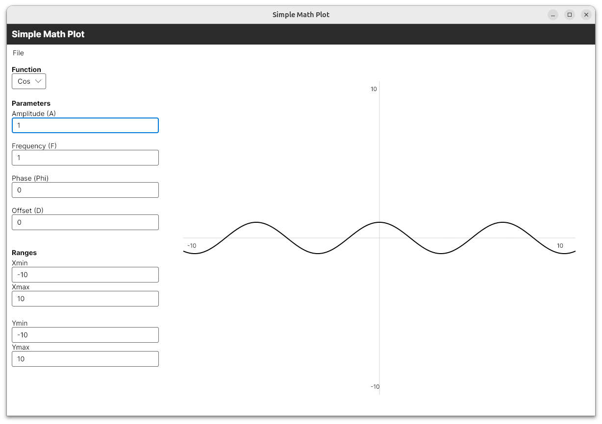
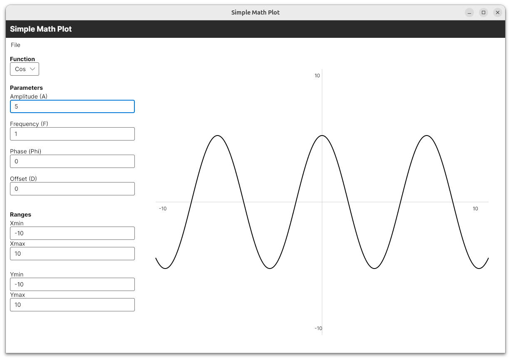
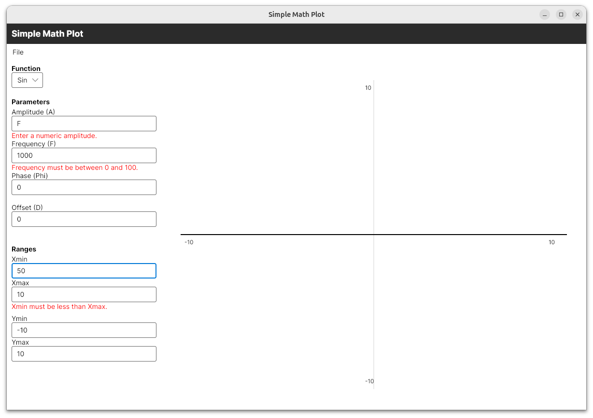
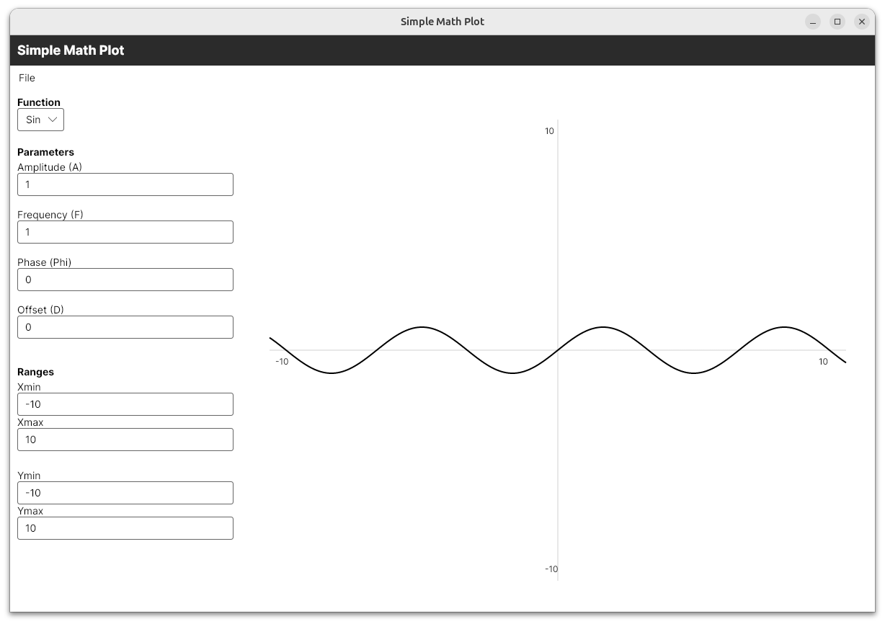
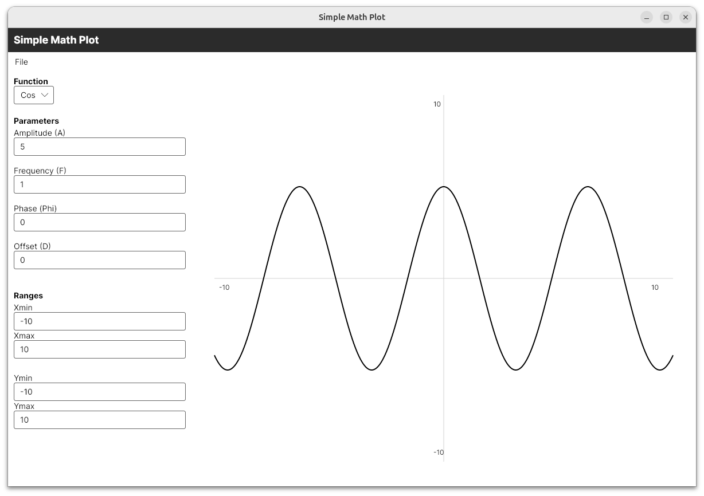
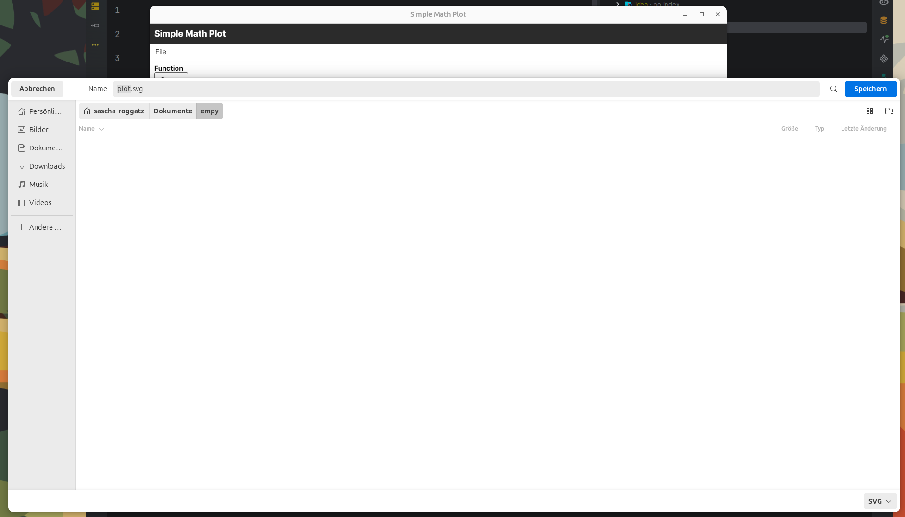

# SimpleMathPlotter

SimpleMathPlotter is a cross-platform application for visualizing mathematical functions, built with C# and Avalonia UI. The project demonstrates clean architecture, modular design, and modern MVVM patterns.

## Features

- Plot mathematical functions with customizable parameters
- Interactive graph visualization with axes and grid
- Modular architecture with clear separation of concerns
- Extensible function engine and export services

### Instant Feedback

Switching Frequency from 1 to 5 yields instant update:



### Validation

Validation for input types and ranges:



### Persistence

Persists the last parameter set.

Fresh start:


After changing parameters and restarting:


### Export

Export graph as svg:



## Technologies Used

- **C# 9.0+**
- **.NET 9.0**
- **Avalonia UI** (cross-platform UI framework)
- **MVVM** (Model-View-ViewModel) design pattern

## Project Structure

- `SimpleMathPlotter.Core` – Core interfaces, models, and function logic
- `SimpleMathPlotter.Infrastructure` – Export and persistence services (e.g., SVG export, JSON persistence)
- `SimpleMathPlotter.Presentation` – ViewModels and presentation logic
- `SimpleMathPlotter.UI` – User interface (Avalonia views and application entry point)

## Getting Started

### Prerequisites
- [.NET 9.0 SDK](https://dotnet.microsoft.com/download)

### Build and Run

1. Clone the repository:
   ```bash
   git clone <REPOSITORY_URL>
   cd SimpleMathPlotter
   ```
2. Restore dependencies:
   ```bash
   dotnet restore
   ```
3. Build and run the application:
   ```bash
   dotnet run --project SimpleMathPlotter.UI
   ```

## Usage

- Select or define a mathematical function in the UI
- Adjust parameters and ranges as needed
- View the plotted graph in real time
- Export graphs or save function configurations

---


